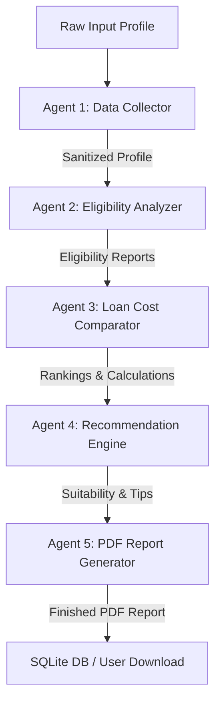

# Smart Loan Advisor — Intelligent Multi-Agent Loan Advisory & Recommendation System

Smart Loan Advisor is a production-grade, AI-powered Loan Recommendation System. It gathers customer financial details, analyzes credit eligibility against banking policy rules, compares costs side-by-side, recommends the top 3 options with detailed advisory summaries, and compiles a premium downloadable 5-page PDF report — all through a conversational AI interface and a premium, cyber-glassmorphism dashboard.

---

## 🛠️ Technology Stack
*   **Backend Framework:** Flask (Python 3.11+) with Flask-CORS for cross-origin frontend communication.
*   **Database:** SQLite (Relational structure tracking customers, recommendations, applications, and logging).
*   **Agent Framework:** CrewAI (Sequential multi-agent orchestration).
*   **LLM Engine:** Google Gemini API (`gemini-2.0-flash` passed via LiteLLM/LangChain).
*   **PDF Generation:** ReportLab (Clean corporate layout).
*   **Frontend UI:** Vanilla HTML5, CSS3 (Premium glassmorphism, responsive grid, gold-navy fintech theme), JavaScript.
*   **Charts & Visualizations:** Chart.js (EMI and Cost Breakdown graphs).

---

## 🚀 Key Features

### 1. Conversational Intake Chatbot (`frontend/chat.html`)
An interactive chatbot designed as a premium conversational interface. It guides users through an intake process collecting essential details: Name, Age, Income, Existing EMIs, Credit Score, Loan Purpose, Desired Amount, Tenure, and Collateral. 

### 2. Credit Score Estimator
If a customer doesn't know their credit score, the chatbot triggers a 6-question behavioral survey. The answers are processed using Gemini API in a prompt-based Credit Risk Scoring algorithm to estimate a score between 300 and 850.

### 3. Recommendation Dashboard (`frontend/index.html`)
A state-of-the-art fintech dashboard displaying:
*   **Intake Profile Summary:** Customer metadata and credit score gauge ring.
*   **Policy Eligibility Badges:** Real-time eligibility state (`Eligible`, `Conditionally Eligible`, `Rejected`) across Loan types.
*   **Top Recommendations:** Ranked matching cards featuring bank names, custom rates, estimated EMIs, advantages, risk warnings, suggested tenures, and negotiation strategies.
*   **Interactive Kanban Status Board:** Allows users to track applications through status pipelines (`Applied` ➔ `Under Review` ➔ `Approved` ➔ `Rejected`) with drag-and-drop or click transitions.
*   **Interactive Slider Calculator:** Real-time client-side calculator adjusting EMI and Debt-to-Income (DTI) ratio instantly.

### 4. "What If" Scenario Simulator
Allows users to slide their income, loan amount, and tenure, sending simulation requests to the backend. The system recalculates policy rules and updates the eligibility badges, interest rates, and comparison charts, providing a dynamic Gemini advisory response.

### 5. Loan Improvement Advisor
Fetches a personalized 3-month action plan generated by Gemini, outlining step-by-step actions (e.g. reducing credit utilization, clearing outstanding balances) and their predicted impact on credit score and DTI.

### 6. Interactive Comparisons & Global History
*   **Chart.js Charts:** Visualizes EMI amounts and total cost breakdown (principal vs interest) side-by-side.
*   **Session Picker:** Loads historical intake sessions to compare profiles or switch active sessions.

---

## 🤖 The Multi-Agent Network (CrewAI Architecture)

The system leverages five sequential agents to process the raw input data:



1.  **Customer Data Collector Agent:** Validates and structures raw chatbot input.
2.  **Eligibility Analyzer Agent:** Runs credit policies, age rules, and DTI threshold filters.
3.  **Loan Product Comparator Agent:** Performs side-by-side financial calculations (EMI, EAR, Interest) and ranks options.
4.  **Recommendation Engine Agent:** Selects the top 3 picks and crafts tailored fits, risks, and negotiation tips.
5.  **Report Generator Agent:** Compiles findings into a premium PDF document under `/reports`.

---

## 📂 Project Structure

```
├── agents/                     # CrewAI Agent Definitions
│   ├── data_collector.py
│   ├── eligibility_analyzer.py
│   ├── loan_comparator.py
│   ├── recommendation_engine.py
│   └── report_generator.py
├── backend/                    # Flask Server & Routes
│   ├── routes/
│   │   ├── customer.py
│   │   ├── loans.py
│   │   └── recommendations.py
│   ├── app.py
│   └── database.py
├── data/                       # Database files & seed data
│   ├── eligibility_rules.json
│   ├── loan_products.json
│   └── loansense.db
├── frontend/                   # UI Files
│   ├── chat.html
│   ├── index.html
│   ├── style.css
│   └── script.js
├── reports/                    # Generated PDF reports
├── utils/                      # Calculations & utilities
│   ├── emi_calculator.py
│   ├── llm_client.py
│   ├── logger.py
│   └── pdf_report.py
├── crew_main.py                # Main orchestration runner
├── requirements.txt            # Python dependencies
└── README.md                   # Setup and usage guide
```

---

## 🛠️ Installation & Setup

### Prerequisites
*   Python 3.11+
*   Google Gemini API Key (set in `.env`)

### Setup Instructions
1.  **Clone or navigate to the workspace directory:**
    ```bash
    cd "Loan Agent"
    ```

2.  **Verify or create virtual environment:**
    If not already initialized, create the environment:
    ```bash
    python -m venv venv
    ```

3.  **Install dependencies:**
    ```bash
    .\venv\Scripts\pip install -r requirements.txt
    ```

4.  **Configure environment variables:**
    Ensure you have a `.env` file in the root directory containing your API key:
    ```env
    GEMINI_API_KEY=your_google_gemini_api_key_here
    PORT=5000
    FLASK_ENV=development
    ```

---

## 🏃 Running the Application

### 1. Start the Flask Backend Server
Run the Flask module using python's module execution flag `-m` to resolve import pathways:
```bash
.\venv\Scripts\python -m backend.app
```
*The server will initialize the SQLite database, seed catalog products, and listen on `http://localhost:5000`.*

### 2. Launch the Frontend UI
Simply double-click/open `frontend/chat.html` in any web browser. You can also host the folder using any simple static HTTP server, for example:
```bash
python -m http.server 8000 --directory frontend
```
Navigate to `http://localhost:8000/chat.html` to start.

---

## 🔧 Technical Workarounds Implemented

*   **Python 3.14/3.15 Metaclass Support:** In new Python releases, Pydantic V1 metaclass construction fails when `__annotations__` is not present. The virtual environment's pydantic main class generation was patched to pull annotations from PEP 649 `__annotate_func__`.
*   **ChromaDB Validator Ordering:** Moved the field declaration of `chroma_server_nofile` before its validator inside `chromadb/config.py` to prevent validation errors.
*   **Windows Unicode Print Guard:** Console logs filter out unsupported currency symbols (like `₹`) during output streams to prevent Windows shell encoding crashes.
